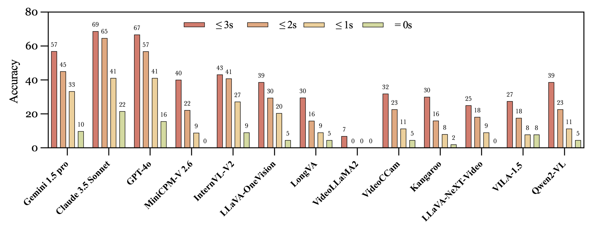

# StreamingBench: Assessing the Gap for MLLMs to Achieve Streaming Video Understanding

<div align="center">
  

  <div style="margin: 30px 0">
    <a href="https://streamingbench.github.io/" style="margin: 0 10px">🏠 Project Page</a> |
    <a href="https://arxiv.org/abs/2411.03628" style="margin: 0 10px">📄 arXiv Paper</a> |
    <a href="https://huggingface.co/datasets/mjuicem/StreamingBench" style="margin: 0 10px">📦 Dataset</a> |
    <a href="https://streamingbench.github.io/#leaderboard" style="margin: 0 10px">🏅Leaderboard</a>
  </div>
</div>

**StreamingBench** evaluates **Multimodal Large Language Models (MLLMs)** in real-time, streaming video understanding tasks. 🌟


------

[**NEW!** 2025.05.15] 🔥: [Seed1.5-VL](https://github.com/ByteDance-Seed/Seed1.5-VL) achieved ALL model SOTA with a score of 82.80 on the Proactive Output.

[**NEW!** 2025.03.17] ⭐: [ViSpeeker](https://arxiv.org/abs/2503.12769) achieved Open-Source SOTA with a score of 61.60 on the Omni-Source Understanding.

[**NEW!** 2025.01.14] 🚀: [MiniCPM-o 2.6](https://github.com/OpenBMB/MiniCPM-o) achieved Streaming SOTA with a score of 66.01 on the Overall benchmark.

[**NEW!** 2025.01.06] 🏆: [Dispider](https://github.com/Mark12Ding/Dispider) achieved Streaming SOTA with a score of 53.12 on the Overall benchmark.

[**NEW!** 2024.12.09] 🎉: [InternLM-XComposer2.5-OmniLive](https://github.com/InternLM/InternLM-XComposer) achieved 73.79 on Real-Time Visual Understanding.

------

## 🎞️ Overview

As MLLMs continue to advance, they remain largely focused on offline video comprehension, where all frames are pre-loaded before making queries. However, this is far from the human ability to process and respond to video streams in real-time, capturing the dynamic nature of multimedia content. To bridge this gap, **StreamingBench** introduces the first comprehensive benchmark for streaming video understanding in MLLMs.

### Key Evaluation Aspects
- 🎯 **Real-time Visual Understanding**: Can the model process and respond to visual changes in real-time?
- 🔊 **Omni-source Understanding**: Does the model integrate visual and audio inputs synchronously in real-time video streams?
- 🎬 **Contextual Understanding**: Can the model comprehend the broader context within video streams?

### Dataset Statistics
- 📊 **900** diverse videos
- 📝 **4,500** human-annotated QA pairs
- ⏱️ Five questions per video at different timestamps
#### 🎬 Video Categories
<div align="center">
  
</div>

#### 🔍 Task Taxonomy
<div align="center">
  
</div>

## 📐 Dataset Examples
https://github.com/user-attachments/assets/e6d1655d-ab3f-47a7-973a-8fd6c8962307
<div align="center">
  <video width="100%" controls>
    <source src="./figs/example.video" type="video/mp4">
    Your browser does not support the video tag.
  </video>
</div>

## 🔮 Evaluation Pipeline

### Requirements

- Python 3.x
- ffmpeg-python

### Data Preparation

1. **Download Dataset**: Retrieve all necessary files from the [StreamingBench Dataset](https://huggingface.co/datasets/mjuicem/StreamingBench).
   
2. **Decompress Files**: Extract the downloaded files and organize them in the `./data` directory as follows:

   ```
   StreamingBench/
   ├── data/
   │   ├── real/               # Unzip Real Time Visual Understanding_*.zip into this folder
   │   ├── omni/               # Unzip other .zip files into this folder
   │   ├── sqa/                # Unzip Sequential Question Answering_*.zip into this folder
   │   └── proactive/          # Unzip Proactive Output_*.zip into this folder
   ```

3. **Preprocess Data**: Run the following command to preprocess the data:

   ```bash
   cd ./scripts
   bash preprocess.sh
   ```

### Model Preparation

Prepare your own model for evaluation by following the instructions provided [here](./docs/model_guide.md). This guide will help you set up and configure your model to ensure it is ready for testing against the dataset.

### Evaluation

Now you can run the benchmark:

```sh
bash eval.sh
```

This will run the benchmark and save the results to the specified output file. Then you can calculate the metrics using the following command:
```sh
bash stats.sh
```

## 🔬 Experimental Results

### Performance of Various MLLMs on StreamingBench
- 60 seconds of context preceding the query time (Main)
<div align="center">
  
</div>

- All Context (+ Long Context)
<div align="center">
  
</div>


- Comparison of Main Experiment vs. 60 Seconds of Video Context
- <div align="center">
  
</div>

### Performance of Different MLLMs on the Proactive Output Task
*"≤ xs" means that the answer is considered correct if the actual output time is within x seconds of the ground truth.*
<div align="center">
  
</div>


## 📝 Citation
```bibtex
@article{lin2024streaming,
  title={StreamingBench: Assessing the Gap for MLLMs to Achieve Streaming Video Understanding},
  author={Junming Lin and Zheng Fang and Chi Chen and Zihao Wan and Fuwen Luo and Peng Li and Yang Liu and Maosong Sun},
  journal={arXiv preprint arXiv:2411.03628},
  year={2024}
}
```
